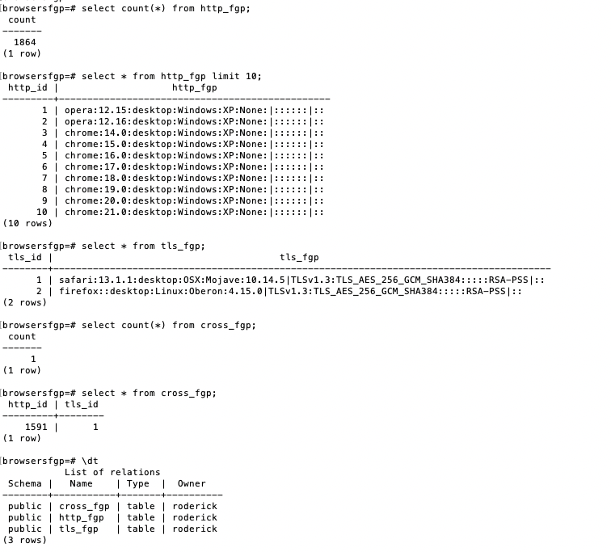

# Fingerprint_Database_Generator
The MITMEngine project (https://github.com/cloudflare/mitmengine) detects HTTPS interception and user agent spoofing by checking if the TLS fingerprint of an incoming connection corresponds to the expected fingerprint for the connection’s user agent. MITMEngine powers the MALCOLM dashboard (https://malcolm.cloudflare.com). The goal of this project is to use BrowserStack to generate TLS client hello fingerprints and user agents for a selection of recent browsers and store them in a Postgres database.


## Configuration Steps

#### 1- On MacOS Mojave 

a- Install version 12.3 postgresql on Mac using: https://www.robinwieruch.de/postgres-sql-macos-setup;  you can run "brew install postgresql"

b- Create postgresql database with a table listing the http fingerprints, a table listing the tls fingerprints and a third table storing the matching of their respective ids (run script ). 
 
  
#### 1- On Ubuntu
 
a- Install version 12.3 postgresql on Ubuntu using: https://www.postgresql.org/docs/9.0/tutorial-install.html
  * In case you get the error `createdb: could not connect to database template1: FATAL:  Peer authentication failed for user "postgres"`,  
     * run `sudo nano /etc/postgresql/10/main/pg_hba.conf` and 
     * replace `local   all             postgres                                peer` by `local   all             postgres                                trust`
     * `sudo /etc/init.d/postgresql reload 


2- Create an account on BrowserStack (a free account would be enough for this project); automate browserstack for python using https://www.browserstack.com/automate/python. 
  * install behave-browserstack (https://github.com/browserstack/behave-browserstack.git) -- not sure this is compulsory
  
  
3- Download and install mitmengine (Not necessary for the project) 
  * setup Go (https://golang.org/dl/go1.14.4.linux-amd64.tar.gz) using https://golang.org/doc/install
  * install and run vendering or gomo logic using https://gocodecloud.com/blog/2016/03/29/go-vendoring-beginner-tutorial/ 
  * Use Go 1.14.1 (go version go1.14.4 linux/amd64 for linux and go1.14.4 darwin/amd64 for macOS). In case you needed to uninstall Go, use https://stackoverflow.com/questions/42186003/how-to-uninstall-golang
  * set GOPATH to /home/username/go/
  * run ``make test`` and ``make cover`` in ```/home/username/go/src/github.com/cloudflare/mitmengine```
 
 
4- Generate TLS fingerprints
  * Run Browserstack in a local setting and combine with Wireshark to infer TLS header: issues while running ```paver run local```. 
  * Generate TLS fingerprints samples using https://github.com/cloudflare/mitmengine#generate-a-fingerprint-sample
  


## Writeup on design choices

1- Design of the Postgresql database.
We created 3 tables with the primary keys (PK) and informations below. Table 3 links the HTTPS fingerprints to the TLS fingerprints using their respective IDs (http_is and tls_id). 

```
          Table 1: "http_fgp"
  Column   |     Type      | Modifiers
-----------+---------------+-----------
 http_id   | integer (PF)  | not null
 http_fgp  | character(500) |


          Table 2: "tls_fgp"
  Column   |     Type      | Modifiers
-----------+---------------+-----------
 tls_id   | integer (PF)   | not null
 tls_fgp  | character(500) | 


                Table 3: "cross_fgp"
  Column   |     Type                   | Modifiers
-----------+----------------------------+-----------
 http_id   | integer (FK from Table 1)  | not null
 tls_id    | integer (FK from Table 2)  | not null
 
```

2- HTTPS fingerprints generation

By running the command,  `curl -u "username:key" https://api.browserstack.com/automate/browsers.json > browsers_infos.json`, we get a list of desired capabilities for both desktop and mobile browsers of Browserstack. The command returns a flat hash in the format [:os, :os_version, :browser, :browser_version, :device, :real_mobile]. We chose to use the outputs to build the HTTPS fingerprints of all available devices. We adopted the following format for HTTPS fingerprints; non available informations are ommitted. As a consequence, our HTTPS fingerprints are basically composed of the uaFingerprints.

```<browser_name>:<browser_version>:<os_platform>:<os_name>:<os_version>:<device_type>:<quirks>|<tls_version>:<cipher_suites>:<extension_names>:<curves>:<ec_point_fmts>:<http_headers>:<quirks>|<mitm_name>:<mitm_type>:<mitm_grade>```

We stored 1,864 entries in Table 1.


3- TLS fingerprints generation

As for the TLS request fingerprint string, we adopted the following format (see MITMEngine Github):

```<tls_version>:<cipher_suites>:<extension_names>:<curves>:<ec_point_fmts>:<http_headers>:<quirks>```

We planned to use the selenium and network logs from browserstack to build the TLS fingerprints corresponding to each of the 1,864 browsers' HTTPS fingerprints. But none of the fields above were found in those files. The second option was to run browserstack in local testing mode, while launching traffic capture with wireshark. Trying that method led to the following: 

```
./BrowserStackLocal --key sxuyw68wEHXq9TEPxrnH --force-local
Thu Jul 02 2020 13:01:50 GMT-0700 (PDT) -- BrowserStackLocal v8.0

(Not all processes could be identified, non-owned process info
 will not be shown, you would have to be root to see it all.)
(Not all processes could be identified, non-owned process info
 will not be shown, you would have to be root to see it all.)
Thu Jul 02 2020 13:01:51 GMT-0700 (PDT) -- Starting configuration console on http://localhost:45454
Thu Jul 02 2020 13:01:51 GMT-0700 (PDT) -- [INFO] Started the BrowserStack Binary server on 45691, PID: 12357
Thu Jul 02 2020 13:01:52 GMT-0700 (PDT) -- [SUCCESS] You can now access your local server(s) in our remote browser

Thu Jul 02 2020 13:01:52 GMT-0700 (PDT) -- Press Ctrl-C to exit
```

And we obtained the following error:

```
~/go/src/github.com/cloudflare/behave-browserstack$ paver run local
---> pavement.run
CONFIG_FILE=config/local.json TASK_ID=0 behave features/local.feature
HOOK-ERROR in before_feature: BrowserStackLocalError: Either another browserstack local client is running on your machine or some server is listening on port 45690
Feature: BrowserStack Local Testing # features/local.feature:1
HOOK-ERROR in after_feature: AttributeError: 'Context' object has no attribute 'browser'

0 features passed, 1 failed, 0 skipped
0 scenarios passed, 0 failed, 0 skipped, 1 untested
0 steps passed, 0 failed, 0 skipped, 0 undefined, 2 untested
Took 0m0.000s

Captured Task Output:
---------------------

---> pavement.run
CONFIG_FILE=config/local.json TASK_ID=0 behave features/local.feature

Build failed running pavement.run: Subprocess return code: 1
```

We thus generated two fingerprints samples locally (On an Ubuntu machine with a firefox browser and a MacOS Mojave with a safari browser) using the commands listed at: https://github.com/cloudflare/mitmengine#generate-a-fingerprint-sample. Assuming that having most of the fields in the UAfingerprints which are identical means that the HTTPS fingerprint corresponds to the cosidered TLS fingerprint, we looked for the closest match between the existing HTTPS fingerprints and each of the generated TLS fingerprints and stored ther respective ids in Table 3 (cross_fgp) only if we find such a match. 


## Results


